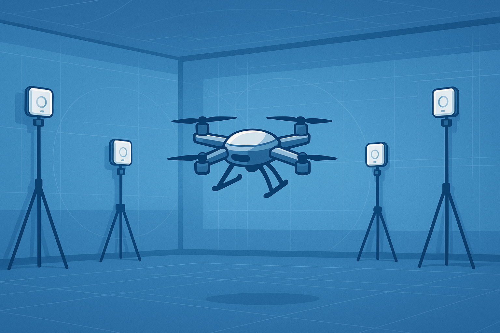

# Drone Localization & Avoidance with RL

<p align="center">
  
</p>

[](./.github/workflows/ci.yml)
[](./LICENSE)

> **Capstone @ ECE496 – University of Toronto · May 2025 → Apr 2026**  
> Real‑time centimetre‑level indoor localization using Ultra‑Wideband (UWB) and deep‑RL obstacle avoidance for an autonomous quadcopter swarm.

---

## 📜 Project Overview
We are building a **low‑cost, tripod‑mounted UWB anchor network** and an **on‑board Jetson‑based autonomy stack** that enables drones to navigate safely without GPS.  
Key goals:

1. **≤ 10 cm RMS position error** at ≥ 50 Hz update rate in a 6 m × 6 m booth.
2. **Reactive avoidance** using ORCA baseline → PPO‑trained policy (domain randomization).
3. **Single showcase drone + two localization‑only minis** for the final design fair.


## 🚧 Roadmap
| Phase | Timeline | Milestone |
|-------|----------|-----------|
| **0** | May 2025 | Hardware orders, repo & dev‑env bootstrap |
| **1** | Jun 2025 | **4‑anchor** seq‑TWR replication (baseline) |
| **2** | Jul 2025 | **6‑anchor** wireless‑sync **TDoA/STAMP** @ 50 Hz |
| **3** | Aug 2025 | EKF on Jetson → ≤ 10 cm RMS |
| **4** | Sep 2025 | Gazebo/Ignition sim w/ UWB plugin |
| **5** | Oct 2025 | ORCA reactive avoidance in sim |
| **6** | Nov 2025 | PPO policy training + sim2real validation |
| **7** | Jan 2026 | Real‑flight RL demo |
| **8** | Apr 2026 | Design‑fair booth setup & documentation |

*(Detailed weekly sprints live in our GitHub Projects board.)*


## 📂 Repository Structure
```
.
├── src/                # All production code
│   ├── localization/   # UWB ranging + anchor sync (C++)
│   ├── avoidance/      # ORCA & RL agents (Python → ONNX)
│   └── utils/          # Shared helpers
├── firmware/           # DW3001 anchor/tag FW + PX4 mods
├── sim/                # Gazebo/Ignition worlds, UWB plugin
├── scripts/            # Tooling (loggers, training launch, plotting)
├── tests/              # Unit & integration tests
├── docs/               # Design docs, diagrams, reports
│   └── media/          # Images for README & docs
└── .github/
    ├── workflows/      # CI definitions
    └── ISSUE_TEMPLATE/ # Bug / feature templates
```


## ⚡️ Quick Start (Simulation‑only)
> Tested on **Ubuntu 22.04**, **ROS 2 Humble**, **Python ≥ 3.10**, **Gazebo Fortress**.

```bash
# 1. Clone recursively & set up workspace
mkdir -p ~/drone_ws/src && cd ~/drone_ws/src
git clone --recursive https://github.com/XiyaoWang0519/Drone_Localization_and_Avoidance_with_RL.git
vcs import < ./.vcs.repos   # pulls external deps listed in .vcs file

# 2. Install apt dependencies (ROS2, Gazebo, PX4 libs)
./scripts/setup_apt.sh      # one‑shot script

# 3. Build
cd ~/drone_ws
colcon build --symlink-install
source install/setup.bash

# 4. Launch UWB world + EKF
ros2 launch sim uwb_demo.launch.py

# 5. Train PPO avoidance policy
python3 scripts/train_ppo.py --env UWBWorld-v0 --timesteps 5e6
```

See **docs/SETUP.md** for full environment details (CUDA, Jetson cross‑compile, etc.).


## 🔌 Hardware Bill‑of‑Materials (BOM)
| Qty | Item | Est. Cost (CAD) | Purpose |
|-----|------|-----------------|---------|
| 6   | **DW3001‑Dev anchors** | 960 | UWB ranging |
| 3   | **Quad frame** (Holybro S500 + Pixhawk 6C) | 390 | Airframe & FC |
| 1   | **Jetson Orin Nano 8 GB** | — (owned) | On‑board compute |
| 6   | USB‑C **power banks** (20 000 mAh) | 300 | Anchor power |
| —   | Tripods, wiring, misc | 200 | Booth setup |
| **Total** |  | **≈ $2 850** |

Full list with links lives in `docs/bom.xlsx`.


## 👩‍💻 Contributing
1. Fork → feature branch (`feature/<thing>`).  
2. Follow the **[commit style](docs/CONTRIBUTING.md)** (`feat: …`, `fix: …`).  
3. `clang-format` / `black` before pushing.  
4. Open a PR into **develop**, link an Issue, pass CI.  
5. One reviewer approval required → merge via squash.

### Code Style
- **C++17** · clang‑format `Google` preset + `include‑what‑you‑use`
- **Python** · PEP8 + type hints · run `ruff`/`black` via pre‑commit


## 🛠️ CI / CD
GitHub Actions (`.github/workflows/ci.yml`) performs:
1. Apt‑caches ROS & Gazebo deps
2. Builds C++ with `colcon` + `clang` static analysis
3. Runs Python unit tests & `pytest`
4. Uploads coverage summary (Codecov)


## 📄 License
Released under the [MIT License](LICENSE). Feel free to fork, hack, and share—just credit us.


## ✨ Acknowledgements
- Qorvo DW3001 dev community for open UWB libs
- PX4 & ROS2 open‑source maintainers
- *Seamless: Multilingual Expressive and Streaming Speech Translation* paper (for RL inspiration!)

---

<p align="center"><i>Fly safe · Code clean · Measure twice, range once ✈️</i></p>
